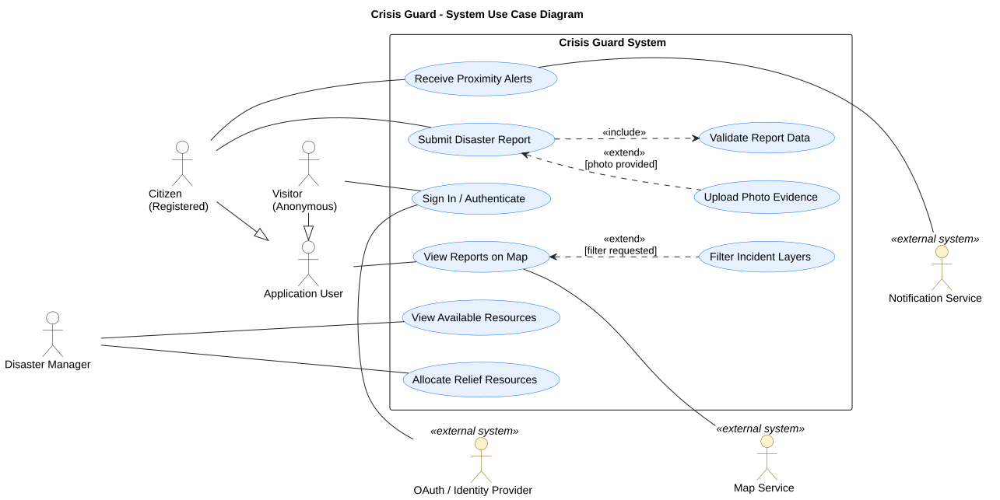

# 3. Use Cases

**Objective:** Show the principal interactions between the application's actors and the system. Describe how an actor achieves a goal and what happens when an important step fails. Base the interactions on the approved requirements and revise them as the application develops.

## 3.1 Use Case Diagram

**Objective:** Show the system boundary, its relevant actors, and their main goals in **one readable UML use case diagram**. Add a focused second diagram only if the complete view cannot remain clear; a third requires a distinct project-specific reason.

**Rendered use case diagram:**   
**Versioned PlantUML source:** [`Source puml`](./puml/3-1-crisis-guard-system-UC.puml)

**Consistency check:** Show the identified roles that **interact with the application**, not stakeholders who have no interaction. Each main user goal must have an associated actor; an included use case can be reached through another use case without its own direct actor association. Use `<<include>>` and `<<extend>>` only when the relationship expresses actual behavior.

<strong>Actors and goals in one diagram</strong>

The diagram below illustrates a **course scenario** with a citizen, a visitor, and an organization that checks available resources. Only include the organization as an actor if the team's approved project actually lets it interact with the application. OAuth is outside this example because it is an implementation-specific sign-in choice and belongs in the requirements only if approved.

[PlantUML source](./puml/3-1-crisis-guard-system-UC.puml) · [Rendered SVG](./assets/diagrams/3-1-crisis-guard-system-UC.svg)

**Actor and goal selection:** The boundary identifies what the application offers, the actors have distinct goals, and no actor or use case claims that this student application dispatches emergency services. Compare the diagram with your approved functional requirements and actors. This PlantUML block is a teaching example, not the versioned source and rendered image of the team's own diagram.

**Five questions for choosing the diagram's content** (not five diagrams to submit):

| Focus | What to ask |
| --- | --- |
| Whole system | Which user goals best explain what this application is for? |
| Key features | Which goals need detail in a description or, if necessary, a separate focused diagram? |
| User roles | Which actors may participate in each goal, and how do their permissions differ? |
| Core processes | Which goal has meaningful alternatives that need a use case description? |
| External integrations | Does another system participate in a use case as a **secondary actor**, such as an approved identity provider during sign-in? |

An external system may appear as a secondary use-case actor when it participates in a user's goal; the architecture describes technical connections. Do not create another required use case diagram solely to inventory integrations. Split a crowded diagram by related actors or goals only when it improves readability.

---

## 3.2 Use Case Descriptions

**Objective:** For each use case in the diagram, explain the actor's goal, the normal interaction with the application, and meaningful alternatives. Describe straightforward use cases briefly; expand those whose alternatives, external dependencies, or consequences require more explanation.

**Use one vertical table per use case.** Write only as much detail as the interaction needs; omit an inapplicable alternative instead of filling it for form's sake.

### UC-[ID]: [Goal-oriented name]

| Field | Description |
| --- | --- |
| Primary actor | [Actor identified in the requirements.] |
| Requirement ID(s) | [Existing functional requirement IDs.] |
| Preconditions, if any | [What must already be true.] |
| Main flow | [Actor's actions and the application's visible responses; number steps when useful.] |
| Alternative or failure flows, if any | [Condition and what the application does; refer to a main-flow step when useful.] |
| Result | [What changes or is confirmed after success.] |

<strong>Registration and disaster reporting: two examples of the same format</strong>

**UC-001: Register account.** This short example applies to a project whose approved task includes email/password accounts.

| Field | Description |
| --- | --- |
| Primary actor | Citizen (A-02 in the example) |
| Requirement ID(s) | F-001 |
| Preconditions, if any | None. |
| Main flow | The citizen submits an email address; the application sends a confirmation link; the citizen confirms the account. |
| Alternative or failure flows, if any | Existing email address → the application explains why registration cannot continue. |
| Result | The account is active after confirmation. |

If the approved task instead uses OAuth-only sign-in, replace this example with the relevant sign-in behavior; do not add local-password registration solely to match the example.

**UC-002: Submit disaster report.** The same fields accommodate a longer flow when location selection, validation, and storage can fail.

| Field | Description |
| --- | --- |
| Primary actor | Citizen |
| Requirement ID(s) | F-004 |
| Preconditions, if any | The report form is available. If the approved task requires sign-in, the citizen has signed in. |
| Main flow | 1. The citizen opens the report form; the application shows fields for disaster type, severity, description, and location. 2. The citizen enters the details and selects a location on the map or by another supported method. 3. The citizen submits the form; the application checks the required fields and the location. 4. The application records the report and displays confirmation with a reference to it. |
| Alternative or failure flows, if any | **1a — Sign-in fails:** If sign-in is required and the identity provider does not complete it, the report remains unsubmitted and the application explains how to retry. **2a — Location permission denied:** If geolocation is offered but denied, the citizen selects the location manually if that option exists; the flow continues at step 3. **3a — Invalid or missing location:** The application explains the problem, preserves entered information where possible, and does not record the report; the citizen corrects it and retries step 3. **3b — Storage fails:** The application reports failure and does not falsely confirm submission. |
| Result | The application records the report and confirms its submission. |

**Choosing the level of detail:** Both examples use the same fields. UC-001 is brief because its principal exception is clear; UC-002 needs numbered steps and alternatives because they change the outcome and can guide tests. Remove sign-in or geolocation branches that do not exist in the team's application. Notifying rescue teams, initiating a rescue operation, or delivering responders' updates introduces **separate capabilities with external consequences**; document them only if the approved task and implementation support them. Password recovery applies to local-password accounts, not automatically to an OAuth-only task. Use the requirement IDs and behavior of your own application when adapting these examples.

---

## 3.3 Use Case Consistency Check

**Objective:** Check that use cases, actors, and requirements agree with one another and with the application the team demonstrates.

| Check | Question for the team |
| --- | --- |
| Requirement | Does each important use case link to an existing requirement? |
| Actor | Does the actor here match an identified role and its permitted interaction? |
| Application | Can the team demonstrate the described main result and important alternative, or is the description marked as a current design? |

---

Maintain the requirement-to-use-case-to-test mapping **once, in the [requirement traceability table](./2.-Requirements)**. Do not maintain a second project mapping or an implementation-status column here. If an important requirement has no interaction with a human actor, explain where it is addressed instead of inventing an actor.

<strong>Checking requirement coverage</strong>

**Example — a use-case coverage table to examine:**

| Use Case Number | Use Case Name | Functional Requirements Covered |
| --- | --- | --- |
| UC-001 | Register account | F-001: Account registration by email |
| UC-002 | Disaster Reporting | F-022: Disaster event reporting and validation |
| UC-003 | Emergency Alert System | F-045: Sending alerts to users and teams |
| UC-004 | Rescue Coordination | F-067: Coordinating with emergency services |

---

**Coverage issues to resolve:** 

- **Wrong requirement ID:** this table links UC-002 to F-022, but the UC-002 description in 3.2 cites F-004, the report-submission requirement in 2.1.
- **Requirements that do not exist:** F-022, F-045, and F-067 are not defined in the example requirements in 2.1.
- **Use cases without descriptions:** UC-003 and UC-004 have no description in 3.2. UC-004 (coordinating with emergency services) is also a capability with external consequences, which the scope allows only if the approved task includes it.
- **Actor mismatch:** the actor example in 2.3 has the Disaster Manager submitting reports (F-004), while UC-002 has a Citizen submitting them.

