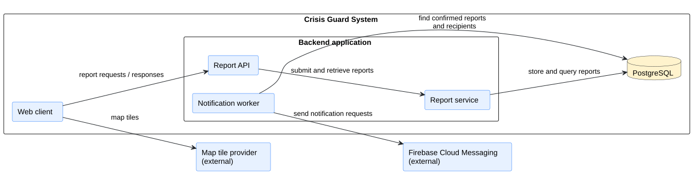
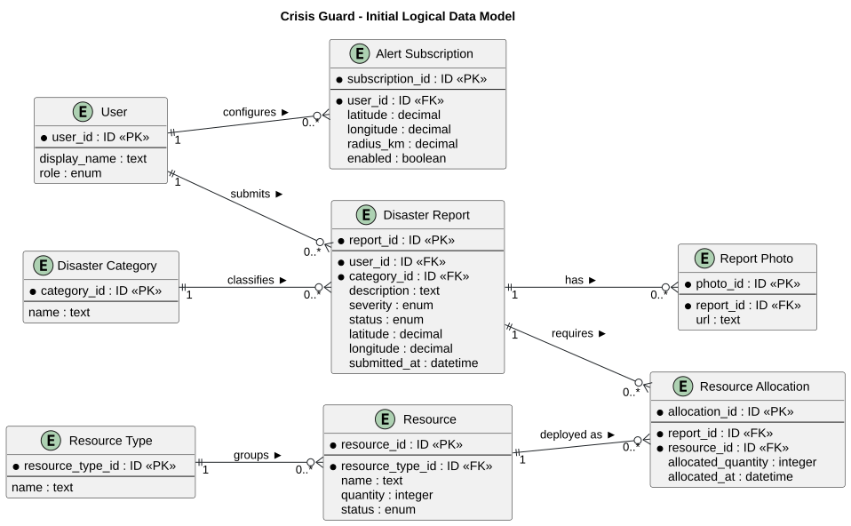
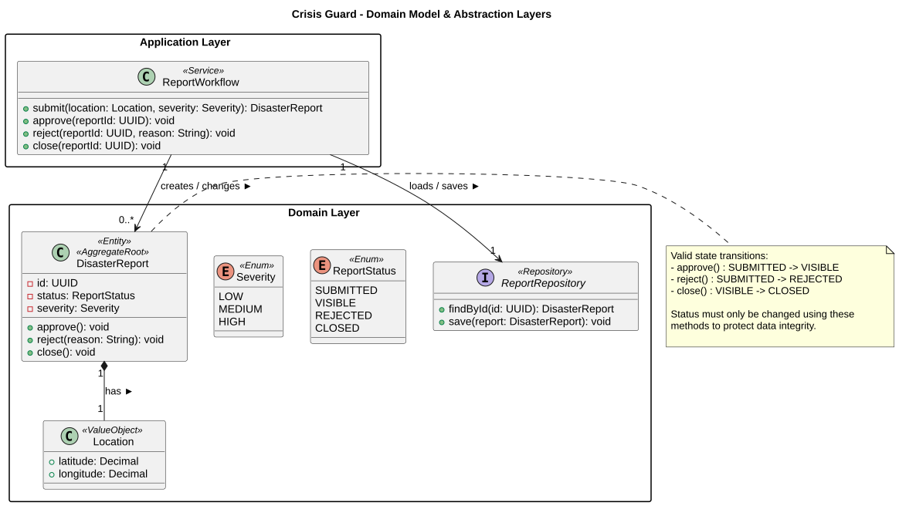
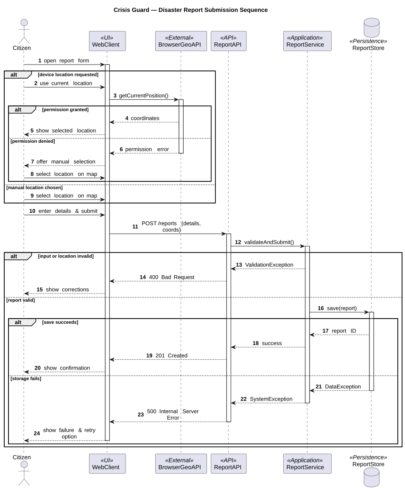
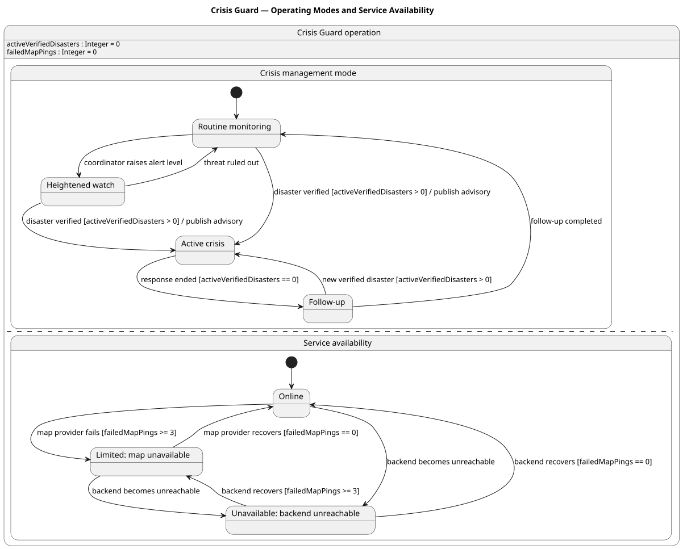

# 4. Architecture and Design

**Objective:** Design and explain the application's boundary, main choices, parts, data, and important behavior. Start with an architecture that guides implementation; revise it when design decisions change. At the final review, the descriptions and diagrams should explain the application that was actually built.

The page contains the **UML component, class, sequence, and state diagrams** and the data model. The use case diagram describes user goals; the deployment diagram shows where the finished application actually runs. Keep a readable image and versioned PlantUML source for each UML diagram, as described on [Home](./Home.md).

The expandable Crisis Guard examples illustrate a proposed design. Use your project's own decisions and models in the completed page.

| View | Main question |
| --- | --- |
| Solution strategy | Which architectural choices were made, and why? |
| Building blocks | What are the principal parts, their responsibilities, and their external connections? |
| Data and class design | What information is stored, and how is a representative part of the code structured? |
| Runtime behavior | How do parts collaborate, and how does a meaningful object change state? |
| Architectural decisions | Why was a consequential option chosen over alternatives? |
| Crosscutting concepts and risks | Which shared mechanisms and important compromises affect the design? |

## 4.1 Solution Strategy

**Objective:** Explain the few architectural choices that most affect the solution and their project-specific reasons.

| Decision | Alternative considered | Project-specific rationale and trade-off |
| --- | --- | --- |
|  |  |  |

Explain the main architectural choices without repeating the technologies list. If an important choice has an ADR, its ID in the table is enough.

<strong>Explaining a choice </strong>

**Example — Crisis Guard:**

| Decision | Alternative considered | Project-specific rationale and trade-off |
| --- | --- | --- |
| Browser client and one backend API | Several separately deployed backend services | The client displays the map while the backend validates and stores reports. One backend is manageable for this scope; its failure may interrupt report operations. See ADR-01 for the reasoning. |
| Relational storage for reports | Document-oriented storage | Reports have identifiable links to users and locations. A relational schema makes these relationships explicit but requires migrations when the schema changes. |

**Analysis of the example:** Both decisions state a reason tied to the reporting application and acknowledge a trade-off. The backend choice links to ADR-01 rather than repeating the full comparison. Modules within one deployable backend are not separate microservices. In your own table, include alternatives that the team genuinely considered.

## 4.2 Building Blocks and UML Component Diagram

**Objective:** Propose the principal parts of the application, assign their responsibilities, and show their dependencies without diagramming every file or class. Revise this view as the system takes shape.

**Component diagram:** [Embed a readable UML component diagram.]  
**PlantUML source:** [Link to the matching versioned `.puml` file.]

| Component | Responsibility | Reason for this boundary |
| --- | --- | --- |
|  |  |  |

Start by drawing the boundary around the proposed system. Inside it, identify parts with distinct responsibilities; put a planned application database inside this boundary and third-party services outside it. Label important connections with what crosses them. A logical component may be a module within one backend application: a separate box does not imply a separately deployed service. As you implement, update the diagram when responsibilities or connections change. In the final version, readers should be able to relate its parts to the code. The deployment diagram answers where those parts actually run.

<strong>System boundary, responsibilities, and external dependencies</strong>

**Example — Crisis Guard:** The proposed architecture supports report submission, a map view, and notifications about confirmed reports.

  
[PlantUML source](./puml/4-1-crisis-guard-system-CMP.puml)

| Part | Responsibility | Reason for this boundary |
| --- | --- | --- |
| Web client | Shows reports and collects a new report. | User interaction is separated from report rules and persistence. |
| Report API | Accepts report requests and returns responses. | HTTP-facing responsibilities are separated from report processing. |
| Report service | Applies report rules and accesses stored reports. | Report validation and storage rules have a clear owner. |
| Notification worker | Identifies eligible recipients and asks an external provider to send an alert. | Notification work is separate from answering a user's report request. |

**Analysis of the example:** The outer boundary distinguishes the proposed system from the map provider and the notification provider. The inner boundary groups the Report API, Report service, and Notification worker within one backend application; their separate symbols express proposed responsibilities, not independently deployed services. PostgreSQL stores application data, while the map provider supplies map tiles. The arrows summarize dependencies, not the order of a transaction; the sequence diagram covers that order. Omit the Notification worker and Firebase Cloud Messaging if notifications are outside the approved scope. If separating the Report API from the Report service does not help explain the design, show one backend component. Include a sign-in provider only if the approved task calls for it. As implementation progresses, revise any proposed boundary that proves inaccurate; the final diagram must correspond to what the team built. One coherent component view is more useful than several near-identical versions with conflicting connections.

## 4.3 Data and Detailed Design

**Objective:** Explain the important information the application stores and one representative area of class-level design. The data model and UML class diagram answer different questions; one does not replace the other.

### 4.3.1 ER Diagram and Data Model

**Objective:** Show the important stored entities, their identifiers and relationships, and enough attributes to explain the application's data. The ER diagram is separate from the representative UML class diagram below.

**ER diagram:** [Embed the project's readable diagram.]  
**Diagram source:** [Link to its versioned source.]  
**Implementation:** [Indicate where the corresponding data model is defined in the project.]

<strong>One flood report and its related data</strong>

**Example — Crisis Guard:** Ana submits flood report `R-104` using her citizen account. She selects a location on the map and records the severity as high. A citizen may submit several reports; each report belongs to one disaster category, such as *Flood*. The application stores the report and its coordinates. Map tiles come from an external provider and are not entities in the application's data model.

  
[PlantUML source](./puml/4-2-crisis-guard-data-ERD.puml)

**Analysis of the example:** `R-104` has one author and one category; Ana and the *Flood* category can each be linked to more reports. The diagram shows relationships without copying a database's columns or writing a second table description for every entity. If your application also accepts **anonymous** reports, represent that possibility in the relationship to `Citizen`. If categories are fixed values rather than stored records, do not invent a category table. Compare the final ER diagram with the persistence model and explain only differences that matter to understanding the project.

### 4.3.2 Representative UML Class Diagram

**Objective:** Before implementing a representative part of the system, model the classes or interfaces needed to assign responsibilities, operations, and relationships. Revise the design when those choices change.

**Class diagram:** [Embed a readable UML class diagram for a representative part of the design.]  
**PlantUML source:** [Link to the matching versioned `.puml` file.]  
**Code reference at the final review:** [Link to the corresponding implementation.]

<strong>Designing report responsibilities and allowed changes</strong>

**Example — Crisis Guard:** A report owns the rules for changing its status. A workflow class coordinates submission and review, while a repository interface describes the persistence operations it needs. The diagram proposes these responsibilities before implementation.

  
[PlantUML source](./puml/4-3-crisis-guard-domain-CD.puml)

**Analysis of the example:** `DisasterReport` owns its allowed state changes, so the workflow cannot silently approve a rejected report. `ReportWorkflow` coordinates an operation without owning the report's transition rules; `ReportRepository` defines the storage operations it needs. The `Location` composition and selected types show relationships useful to the design. The diagram intentionally omits database columns and unrelated classes: the ER model explains stored data, while this diagram assigns program responsibilities and operations. These classes are a design choice, not required layers for every team. Compare the finished implementation with the original design and revise the diagram where decisions changed; generating a diagram from code at the end cannot substitute for this initial modeling.

## 4.4 Runtime Behavior

**Objective:** Explain one important interaction among running parts and the lifecycle of one meaningful object. Choose cases that expose decisions or failure paths instead of making a diagram for every CRUD action.

### 4.4.1 Representative UML Sequence Diagram

**Objective:** Show the order of messages for one representative scenario and the responses to a meaningful alternative.

**Scenario:** [Name the interaction; add the UC ID if one exists.]  
**Sequence diagram:** [Embed a readable UML sequence diagram.]  
**PlantUML source:** [Link to the matching versioned `.puml` file.]

<strong>Location selection, validation, and report submission</strong>

**Example — Crisis Guard:** A citizen submits a disaster report after choosing a location manually or requesting the device's position. The interaction also shows what happens when location permission is denied, report data is invalid, or storage fails.

  
[PlantUML source](./puml/4-4-crisis-guard-report-submission-SD.puml)

**Analysis of the example:** The two location paths and the validation and storage alternatives have different consequences for the user; compare them with the matching use case and its alternative flows. The browser location API is a browser capability; the web client, API, service, and store correspond to the component view. Select branches that help explain your project's scenario, and revise the final diagram to match the implemented interaction.

### 4.4.2 Representative UML State Diagram

**Objective:** Show the meaningful states of one domain object or an explicitly managed system mode, and the events or conditions that change it.

**State owner and reason for choosing it:** [Name the object or system mode, how its state is recognized, and why the transitions matter.]  
**State diagram:** [Embed a readable UML state diagram.]  
**PlantUML source:** [Link to the matching versioned `.puml` file.]

<strong>Operating modes and service availability</strong>

**Example — Crisis Guard:** The crisis coordination mode changes as an disaster is assessed and resolved. At the same time, the user-visible availability of the application may change independently when the map provider or backend becomes unavailable.

  
[PlantUML source](./puml/4-5-crisis-guard-report-SM.puml)

**Analysis of the example:** The two regions describe independent aspects of the modeled system: its crisis coordination mode and observed service availability. They run in parallel; an active crisis may coincide with normal or limited service. The branches after backend recovery account for a map provider that may still be unavailable. State transitions have named triggers or guards rather than being a list of screens. Use this form only if your application actually maintains or reliably derives both kinds of state. A project whose meaningful lifecycle belongs to a report, reservation, or order should model that object instead; diagram complexity is not an assessment criterion. At the final review, check the state model against the behavior the running application supports.

## 4.5 Architecture Decision Records

**Objective:** Preserve the reasons for consequential architectural choices so a future developer can understand what was decided, what alternative was considered, and which trade-off the team accepted.

**Decision index:** [List important architectural decisions in one place. A short row is sufficient for a straightforward decision.]

| ID | Date | Decision | Alternative considered | Rationale and trade-off | Status |
| --- | --- | --- | --- | --- | --- |
|  |  |  |  |  |  |

**Detailed ADR, when the decision needs more explanation:**

### ADR-[ID]: [Decision title]

| Field | Record of the decision |
| --- | --- |
| Context and goal | [Which architectural problem made this decision necessary?] |
| Decision criteria | [What actually mattered to the team?] |
| Alternatives considered | [Realistic options the team weighed, briefly.] |
| Decision and rationale | [Chosen option, why it won, and what is given up.] |
| Status | [Proposed, accepted, or superseded; link to the replacement when applicable.] |

Write an ADR only for a choice whose rationale will matter after the implementation changes. A significant change of decision can be recorded as a new ADR that supersedes the old one; routine tool choices do not need detailed records. Changes to agreed scope belong with requirements and their change history; feedback on a task stays with its issue.

<strong>Choosing one backend instead of separately deployed services</strong>

**Example — Crisis Guard, ADR-01:**

| ID | Date | Decision | Alternative considered | Rationale and trade-off | Status |
| --- | --- | --- | --- | --- | --- |
| ADR-01 | [Date of decision] | One backend API for report handling | Separate deployable report and resource services | Lower deployment and integration effort for the approved scope; a failure of the backend can affect both features. | Accepted |

### ADR-01: One backend API for report handling

| Field | Record of the decision |
| --- | --- |
| Context and goal | The team must deliver and publicly deploy reporting and a map-oriented view during one semester. |
| Decision criteria | The team can build, integrate, deploy, and explain the solution; components still have identifiable responsibilities. |
| Alternatives considered | **One backend:** modules share a deployable application. **Separate services:** each can run independently, but they require additional integration and deployment work. |
| Decision and rationale | Choose one backend, with distinguishable report responsibilities inside it. This limits deployment work but accepts that a failure of this backend may affect report operations together. |
| Status | Accepted. |

**Analysis of the example:** The solution strategy states the current approach; ADR-01 preserves the alternatives and criteria that led to it. The component and deployment diagrams should reflect the chosen approach as it develops. A separate ADR is useful for a consequential decision, not for every tool choice.

## 4.6 Crosscutting Concepts

**Objective:** Identify an important mechanism or design rule that applies to several parts of the application, describe where it is planned to apply, and update the explanation as the implementation takes shape. Include only concepts that matter to this project.

| Concern | Mechanism and where it applies | Evidence in the final implementation |
| --- | --- | --- |
|  |  |  |

<strong>Describing a shared rule through its implementation</strong>

**Example — Crisis Guard:**

| Concern | Mechanism and where it applies | Code or configuration reference |
| --- | --- | --- |
| System rule: authorization of report moderation | The backend checks the moderator's permissions before approving or rejecting a report; a login button in the client is insufficient protection. | At the final review, show the backend permission check and a test of unauthorized access. |
| Shared implementation rule: location validation | The report-submission boundary rejects missing or invalid coordinates before saving a report. | At the final review, show the validation rule and a test with invalid coordinates. |

**Analysis of the example:** The first row describes protection across the system boundary; the second describes a rule shared by report-submission paths. Choose concerns that actually affect your project.

Patterns such as Dependency Injection or Repository belong here only when the code uses them and they explain a shared design rule. “The system uses authentication” alone does not tell a reader where the check occurs or what it protects. Security, logging, and error handling need not each receive a subsection by default.

## 4.7 Architectural Risks and Technical Debt

**Objective:** State real technical or domain risks and consciously accepted design compromises, their consequences, and what the team will do about them.

**Technical risks and debt**

| Risk or compromise | Consequence | Current treatment |
| --- | --- | --- |
|  |  |  |

**Business or domain risks, if significant**

| Risk | Consequence | Current treatment |
| --- | --- | --- |
|  |  |  |

<strong>Identifying a limitation without inventing production infrastructure</strong>

**Example — Crisis Guard, technical risks:**

| Risk or compromise | Consequence | Current treatment |
| --- | --- | --- |
| One application instance handles report submissions. | Hosting failure temporarily prevents new reports. | Accepted within the course project; the team does not claim automatic failover. |
| External map tiles are unavailable. | The map view may fail even when stored reports remain available. | Explain the visible error or fallback that the implemented application actually provides. |

**Example — Crisis Guard, domain risk:** Readers may mistake an unverified citizen report for an official warning. The team can distinguish the report's verification status in the interface and direct readers to official channels.

**Analysis of the example:** The first technical risk accepts a realistic course-scope limitation; the domain risk concerns how a reader interprets a report. Record a limitation and a realistic response that belong to your own project. A missing mandatory feature is unfinished scope, not technical debt.

**Final consistency check:** Compare the component, data, class, sequence and state views with the implemented code, application behavior, and actual deployment. Update outdated design descriptions and explain any important difference that remains; links to relevant code or tests help when they resolve a concrete question.
