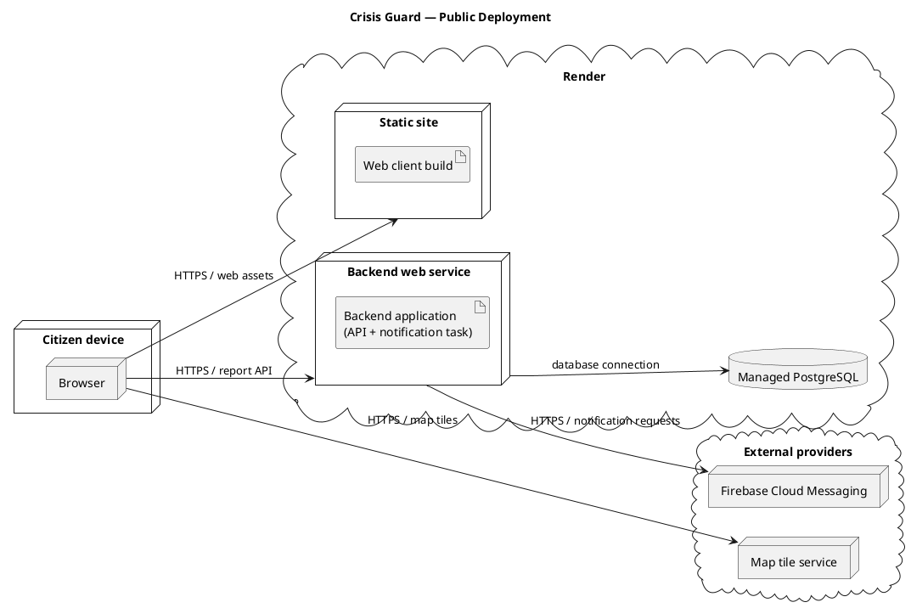

# 6. Deployment, Installation, and Configuration

**Objective:** Show where the application runs, how its deployed parts communicate, and how a reader can install, configure, deploy, and maintain it. The [README](../) gives the public address and the shortest local Quick Start; this page adds the setup details needed to reproduce the application.

The expandable Crisis Guard material is a **teaching example of a possible deployment**, not a description or a test result from the published student project. Replace its topology, settings, and checks with those of your application. Render is used in the example; document the platform your team actually uses.

## 6.1 Deployment View

**Objective:** Identify the running environments, deployed software, data store, and relevant external services. Show communication between them in one UML deployment diagram. A component diagram explains logical responsibilities; this diagram explains where the executable parts run.

**Deployment diagram:** [Embed a readable image of your UML deployment diagram.]  
**PlantUML source:** [Link to the matching, versioned `.puml` file.]  
**Public application:** [Link to the live address recorded in the README, or link to its Deployment section.]  

Label the actual hosting nodes and important connections. Include a database or external provider only if the deployed application uses it. A development laptop is not the public server. If you changed the intended architecture during implementation, show the resulting deployment here and update the architecture description accordingly.

<details>
<summary><strong>Public deployment of a report and notification application</strong></summary>

**Example — Crisis Guard:** The proposed web client is built as a static site. A backend web service processes reports and runs the notification task in the **same deployed backend application**. PostgreSQL stores reports; a map tile provider serves maps to the browser; Firebase Cloud Messaging receives notification requests from the backend. The example assumes notifications belong to this particular project's scope.



**Analysis of the example:** The static site distributes client files, while the browser executes the client code. The backend's API and notification task remain inside one deployed service despite having separate responsibilities in the component diagram. The database connection comes from the backend, not directly from the browser. The map and notification services are outside the team's hosting environment. These boxes represent deployment locations, not a second inventory of backend modules or a promise of separate servers for each class. Omit FCM and its arrow if notifications are not implemented; include a sign-in provider only when that integration is part of the approved project and is actually deployed. A different host changes the deployment labels, not the purpose of the diagram.

</details>

## 6.2 Installation and Local Configuration

**Objective:** Enable a reader to install and run the complete application from a clean checkout, including services and data that a short README Quick Start cannot explain fully.

1. **Prerequisites and source:** [List the required runtime, package manager, database or other essential service, their supported versions, and how to obtain the repository. State which commands run from the repository root and which from a subdirectory. The README has the short version; give the full procedure here if setup has additional steps.]
2. **Dependencies and local settings:** [Give the real install commands for each part. Name the required configuration variables or files, what each controls, how an authorized reader obtains secret values, and which values may be public. Link to a safe `.env.example` if provided. Never publish real credentials.]
3. **Database and initial data, if used:** [Give the commands and order for creating the local database, granting the application access, applying schema migrations, and loading **only necessary** example data. Identify whether migrations are manual or run on startup. Name actual versioned script paths; explain how to avoid applying the initial schema twice.]
4. **Start and check:** [Show the commands and order for starting each process, the resulting local addresses, and one check that proves the client can use the backend and that important data persists. State where a reader can inspect errors when a step fails.]

Include only steps the application actually needs. If the README already contains a complete reproducible procedure, link to it and add the missing details here instead of maintaining two full copies.

<details>
<summary><strong>Installing the report application with a local PostgreSQL database</strong></summary>

**Example — Crisis Guard:** This teaching setup uses a React/Vite client in `frontend/`, a Node.js backend in `backend/`, and PostgreSQL. It models the disaster-reporting topic; it does not assert the technology used by the published Crisis Guard project. Before starting, install compatible Node.js/npm and a PostgreSQL server/client; the finished project page would give the versions verified by its team. Obtain the source with the repository's README clone command. Start PostgreSQL and use a local account permitted to create a database. From the repository root, run:

```bash
createdb crisis_guard_dev
psql -d crisis_guard_dev -f backend/db/001_create_schema.sql
psql -d crisis_guard_dev -c '\dt'
```

The versioned SQL file in this example creates the tables on a **new** database. The `\dt` check should list them. Configure a local PostgreSQL login that can use this schema; record the creation and permission commands if it is a separate account. The Node.js backend in this example reads `DATABASE_URL`: configure it locally to connect to `crisis_guard_dev` through a PostgreSQL URL, with any required credentials in an uncommitted local setting. Do not publish the complete connection URL when it contains a password. If another application uses automatic migrations, start it as instructed and verify that those migrations ran instead of executing a separate schema script. If report examples require seed data, show that project's actual seed command and explain when it should be used.

Start the backend in the first terminal, from the repository root:

```bash
cd backend
npm ci
npm start
```

In a second terminal, also from the repository root, install the client dependencies and start it. Set the public local API URL before starting the client; use your project's configuration mechanism if it differs:

```bash
cd frontend
npm ci
VITE_API_BASE_URL=http://localhost:8080 npm run dev
```

Use the backend address actually printed by the application if it differs from `http://localhost:8080`. Open the client address printed by Vite, submit a report with a location, and retrieve it. The client page loading alone does not show that the backend and database work. If submission fails, inspect the browser's API request and the backend log; if startup fails, check the database connection settings and whether the schema was created. Do not copy this example's paths or commands if your repository differs.

**Analysis of the example:** The procedure has an order: create the database, establish the schema and access, configure connections, start both processes, and check a saved report. Commands and expected observations are specific enough to diagnose an incomplete setup. They complement the README's short route to the application rather than claiming that a web page loading proves installation succeeded.

</details>

## 6.3 Public Deployment and Administration

**Objective:** Enable a reader to reproduce the **public** application from the repository, including the hosted database and connections among deployed parts.

**Hosting and build:** [Name each hosting service actually used, the repository path or branch it deploys, build/start commands or versioned configuration, and when the hosted schema is established. Link to configuration already in Git when a link is clearer than copying it.]

**Required settings:** [List variable **names and purposes**, where an authorized maintainer obtains the values, and which service receives each one. Distinguish browser-visible configuration from backend secrets.]

**Deployment procedure:** [Give the steps in order: create necessary hosted services, configure and migrate the **hosted** database, build and deploy backend and client, connect their public addresses, and find the final URL. Provide the real commands or platform actions for steps that are not evident from versioned configuration.]

**Access and essential administration:** [If the application has an administrator role, give the path to its interface and explain how an authorized person obtains access **without publishing credentials**. Explain how to inspect application errors and redeploy an update on the hosting platform. Document backup or recovery steps only if the team has actually configured and used them. If there is no administrator interface, state that briefly.]

Describe only environments that exist. A staging environment, CI/CD pipeline, health endpoint, scheduled backups, and other routine operations are conditional on what the team has implemented. The project's test cases and results belong in Testing; this page needs only the practical steps for running and maintaining the application.

<details>
<summary><strong>Configuring a Render static site, backend, and database</strong></summary>

**Example — Crisis Guard:** One feasible deployment of the Node.js teaching setup above uses these Render services. The local PostgreSQL database from §6.2 is separate from the managed database serving the public application.

| Deployed part | Source and build/start configuration | Necessary connection or setting |
| --- | --- | --- |
| Static site | `frontend/`; build `npm ci && npm run build`; publish `dist/`. | `VITE_API_BASE_URL` points to the public backend URL. This is browser-visible configuration, not a secret. |
| Backend web service | Choose the Node.js runtime and `backend/` as the repository root directory for this service; build `npm ci`; start `npm start`. | `DATABASE_URL` uses the managed database's **internal** connection URL. The backend must listen on Render's `PORT` at `0.0.0.0`. Configure the permitted client origin if required. |
| Managed PostgreSQL | Create the database in the same Render region as the backend; apply the versioned initial schema to a **new** database before report requests are served. | Obtain connection details from the database's dashboard; keep them private. Apply later migrations separately instead of rerunning the initial creation script. |
| Notification provider | Configure the backend integration only if it belongs to the approved project and was implemented. | Give the server-side credential through the host's secret settings; document its **name**, never its value. |

**Render procedure in this example:**

1. **Connect the repository and create PostgreSQL.** In the Render dashboard, create a Postgres database in the region where the backend will run. Keep the database's internal connection URL for the backend; do not paste it into the Wiki or frontend settings.
2. **Create the hosted schema.** For a new database, use the dashboard's PSQL connection instruction from a trusted terminal at the repository root, if the database permits an external connection. In the connected `psql` session, run `\i backend/db/001_create_schema.sql` and then `\dt` to check the tables. Do not copy the credential-bearing connection instruction into the repository or documentation. If external connections are disabled, the team must describe its actual authorized migration mechanism instead. Do not run the initial creation script again on every deploy.
3. **Create a web service.** Connect the same repository, select the Node.js runtime and the intended branch, set its root directory to `backend/`, its build command to `npm ci`, and its start command to `npm start`. Add `DATABASE_URL` in the service's private environment settings using the database's **internal** URL. Configure the backend to listen on `0.0.0.0` and the port supplied by Render's `PORT` variable. Once deployed, note the backend's public address.
4. **Create a static site.** Connect the repository and choose `frontend/` as its root directory, `npm ci && npm run build` as its build command, and `dist/` as its publish directory. Set `VITE_API_BASE_URL` to the **public backend address** before building the client. This value is visible to the browser; do not use the private database URL here. Note the site's generated public address.
5. **Connect, open, and maintain the application.** If the backend restricts browser origins, allow the public static-site address and redeploy the backend. Open the site, submit a report, and retrieve it; record the site's public address in the README. For a failed deploy, check the service's deployment output and logs in Render; for a new revision, use the repository connection's configured automatic deployment or the dashboard's manual deployment action. Configure any notification credential only on the backend if that feature was actually implemented.

The team replaces the sample directory names, commands, schema mechanism, and settings with the values that work in its own repository. If notifications are unavailable, document the integration honestly; a successful report submission does not establish notification delivery.

If this application includes a moderator interface, name its path and explain how a moderator account is granted through the application or approved team process. Do not publish a default password. Describe database recovery only if the team has arranged a usable backup procedure; do not imply that managed hosting automatically guarantees recovery.

 The API and notification work remain one backend deployment, as in the diagram. The procedure distinguishes Render's internal database connection from the public backend URL used by the client, and establishes the hosted schema before handling reports. The frontend build receives only browser-visible configuration; database and provider secrets stay on the backend. The steps show where to inspect a failure and how to publish an update. Render is one teaching example, so another platform requires a description of its own setup.

</details>

**Final consistency check:** A reader can follow the local and hosted setup with the project's real commands and settings; the diagram matches the public deployment; the README link opens the application; and the administration instructions describe only capabilities the team actually provides, without disclosing credentials.
